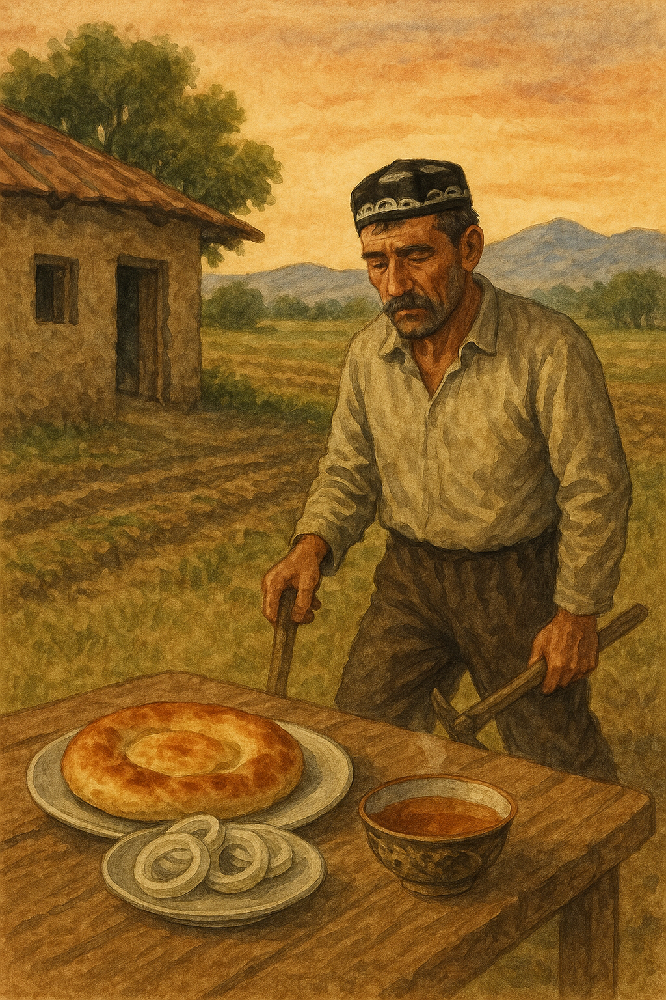

# O'zbek tili - Kundalik tartib va vaqtni aytish
## Uzbek Language - Daily Routines and Telling Time

**Daraja / Level:** Boshlang'ich / Elementary  
**Mavzu / Topic:** Kundalik tartib va vaqt / Daily Routines and Time  
**Maqsad / Objective:** Vaqtni aytishni va kundalik faoliyatlarni tasvirlashni o'rganish / Learning to tell time and describe daily activities

---

## 📚 YANGI SO'ZLAR / NEW VOCABULARY

### ⏰ Vaqt / Time

| O'zbekcha | English |
|-----------|---------|
| soat | hour/clock |
| daqiqa | minute |
| vaqt | time |
| erta | early |
| kech | late |
| ertalab | morning |
| tushda | at noon |
| kechqurun | evening |
| tunda | at night |

### 🏃‍♂️ Kundalik faoliyatlar / Daily Activities

| O'zbekcha | English |
|-----------|---------|
| uyg'onmoq | to wake up |
| turmoq | to get up |
| uyquga yotmoq | to go to sleep |
| ishga bormoq | to go to work |
| ovqat yemoq | to eat |
| nonushta qilmoq | to have breakfast |
| dam olmoq | to rest |
| o'qimoq | to study/read |
| ishlash | to work |

### 📊 Vaqt zaflarining ravishi / Adverbs of Frequency

| O'zbekcha | English |
|-----------|---------|
| har doim | always |
| tez-tez | often |
| ba'zan | sometimes |
| kamdan-kam | rarely/seldom |
| hech qachon | never |
| har kuni | every day |
| kuniga ... marta | ... times a day |
| haftasiga ... marta | ... times a week |

### 👔 Kasblar / Professions

| O'zbekcha | English |
|-----------|---------|
| tadbirkor | businessman |
| dehqon | farmer |
| o'qituvchi | teacher |
| bloger | blogger/vlogger |
| sayohatchi | traveler |
| shifokor | doctor |
| muhandis | engineer |

### 📱 Zamonaviy faoliyatlar / Modern Activities

| O'zbekcha | English |
|-----------|---------|
| suratga olmoq | to film/record |
| tahrirlash | to edit |
| joylashtirmoq | to post/upload |
| sayohat qilmoq | to travel |
| kashf etmoq | to explore/discover |
| tarqatmoq | to share/distribute |
| kuzatmoq | to follow/watch |

---

## ⏰ VAQTNI AYTISH / TELLING TIME

### Asosiy qoidalar / Basic Rules

**Soat + raqam = O'clock**
- 1:00 = bir soat
- 2:00 = ikki soat  
- 6:00 = olti soat
- 12:00 = o'n ikki soat

**Yarim soat / Half past**
- 2:30 = ikki yarim soat
- 4:30 = to'rt yarim soat
- 7:30 = yetti yarim soat

**Daqiqalar bilan / With minutes**
- 3:15 = uch soat o'n besh daqiqa
- 5:45 = besh soat qirq besh daqiqa
- 9:20 = to'qqiz soat yigirma daqiqa

### Misollar / Examples
- **Savol:** Soat necha? (What time is it?)
- **Javob:** Soat olti. (It's six o'clock.)

---

## 👥 TO'RT XARAKTERNI KUNDALIK HAYOTI / FOUR CHARACTERS' DAILY LIVES

### 1. 🎬 AZIZA - YouTube bloger va sayohatchi / YouTube Blogger and Traveler

Aziza yosh YouTube bloger va sayohatchi. U turli vaqtlarda uyg'onadi, chunki **tez-tez** sayohat qiladi. **Har kuni** **to'qqiz soatdan** video suratga olishni boshlaydi. **Ba'zan** **o'n bir soatda**, **ba'zan** **uch soat tushda** turli joylarni kashf etadi.

U **kuniga uch-to'rt marta** yanggi kontentlarni Instagram va YouTube'ga joylashtiradi. **Kechqurun** **yetti soatdan** videolarni tahrirlaydi va **tez-tez** **tun yarimigacha** ishlaydi. **Oyiga ikki marta** yangi shaharlarga sayohat qiladi. **Kamdan-kam** muxlislari bilan uchrashadi. U **har doim** kreativ va energik. **Har kuni** turli vaqtda uyquga yotadi.

**Translation:** Aziza is a young YouTube blogger and traveler. She wakes up at different times because she travels often. Every day she starts filming videos at nine o'clock. Sometimes at eleven o'clock, sometimes at three in the afternoon she explores different places. She posts new content on Instagram and YouTube three-four times a day. In the evening from seven o'clock she edits videos and often works until midnight. She travels to new cities twice a month. She rarely meets with fans. She is always creative and energetic. She goes to sleep at different times every day.

**Verb List:**
1. uyg'onadi
2. sayohat qiladi
3. suratga olishni boshlaydi
4. kashf etadi
5. joylashtiradi
6. tahrirlaydi
7. ishlaydi
8. uchrashadi
9. uyquga yotadi

### 2. 💼 ANVAR - Millioner tadbirkor / Millionaire Businessman

Anvar boy tadbirkor. U **har kuni** **olti soatda** uyg'onadi. **Olti yarim soatda** sport bilan mashg'ul bo'ladi va **tez-tez** yuguradi. **Sakkiz soatda** maxsus nonushta qiladi. **To'qqiz soatda** o'zining katta ofisiga boradi. 

U **tez-tez** muhim uchrashuvlar o'tkazadi va **kuniga besh-olti marta** telefon qo'ng'iroqlari qabul qiladi. **Ba'zan** **yetti soat kechqurun** maxsus restoranlarda kechki ovqat yeydi. **Kamdan-kam** xayriya tadbirlarida ishtirok etadi. **O'n bir soatda** uyquga yotadi.

**Translation:** Anvar is a wealthy businessman. He wakes up every day at six o'clock. At six-thirty he exercises and often goes running. At eight o'clock he has a special breakfast. At nine o'clock he goes to his big office. He often holds important meetings and receives phone calls five-six times a day. Sometimes at seven in the evening he eats dinner at special restaurants. He rarely participates in charity events. He goes to sleep at eleven o'clock.

**Verb List:**
1. uyg'onadi
2. mashg'ul bo'ladi
3. yuguradi
4. nonushta qiladi
5. boradi
6. uchrashuvlar o'tkazadi
7. qabul qiladi
8. yeydi
9. ishtirok etadi
10. uyquga yotadi

### 3. 🌾 KARIM - Sadoqatli dehqon / Humble Farmer

Karim oddiy dehqon. U **har kuni** **to'rt yarim soatda** uyg'onadi. **Besh soatda** mollarga g'amxo'rlik qiladi va **har doim** ularni boqadi. **Olti soatda** dala ishlariga boradi va **kun bo'yi** qattiq ishlaydi.

**O'n ikki soatda** oddiy tushlik qiladi - non, piyoz va choy. **Olti soat kechqurun** uyga qaytadi. **Yetti soat kechqurun** oilasi bilan kechki ovqat yeydi. U **kamdan-kam** dam oladi, chunki ish ko'p. **To'qqiz soatda** uyquga yotadi va **har doim** charchagan bo'ladi.

**Translation:** Karim is a simple farmer. He wakes up every day at four-thirty. At five o'clock he takes care of the livestock and always feeds them. At six o'clock he goes to field work and works hard all day. At twelve o'clock he has a simple lunch - bread, onions and tea. At six in the evening he returns home. At seven in the evening he eats dinner with his family. He rarely rests because there is a lot of work. He goes to sleep at nine o'clock and is always tired.

**Verb List:**
1. uyg'onadi
2. g'amxo'rlik qiladi
3. boqadi
4. boradi
5. ishlaydi
6. tushlik qiladi
7. qaytadi
8. yeydi
9. dam oladi
10. uyquga yotadi
11. charchagan bo'ladi

### 4. 👩‍🏫 DILNOZA - O'rta maktab o'qituvchisi / Middle School Teacher

Dilnoza o'rta maktab o'qituvchisi. U **har kuni** **yetti soatda** uyg'onadi va **yetti yarim soatda** nonushta qiladi. **Sakkiz soatda** maktabga boradi va **sakkiz yarim soatdan** dars berishni boshlaydi.

U **kuniga besh marta** turli sinflarda dars beradi va **tez-tez** o'quvchilar bilan gaplashadi. **Ikki soat tushda** uyga qaytadi va **ba'zan** **to'rt soat kechqurun** uy vazifalarini tekshiradi. **Haftasiga ikki marta** ota-onalar bilan uchrashadi. U **har doim** sabr-toqatli va mehribon. **O'n soatda** uyquga yotadi.

**Translation:** Dilnoza is a middle school teacher. She wakes up every day at seven o'clock and has breakfast at seven-thirty. She goes to school at eight o'clock and starts teaching at eight-thirty. She teaches five times a day in different classes and often talks with students. She returns home at two in the afternoon and sometimes checks homework at four in the evening. She meets with parents twice a week. She is always patient and kind. She goes to sleep at ten o'clock.

**Verb List:**
1. uyg'onadi
2. nonushta qiladi
3. boradi
4. boshlaydi
5. dars beradi
6. gaplashadi
7. qaytadi
8. tekshiradi
9. uchrashadi
10. uyquga yotadi

---

## 🎯 MAQSADLI FE'LLAR / TARGET VERBS FROM STORIES

### Asosiy fe'llar / Main Verbs
Bu fe'llarni ishlatib, har bir qahramon haqida gaplar tuzing. 
*Use these verbs to create sentences about each character.*

| Fe'l / Verb | Ma'nosi / Meaning | Misol / Example |
|-------------|-------------------|-----------------|
| **uyg'onmoq** | to wake up | Anvar har kuni olti soatda uyg'onadi |
| **turmoq** | to get up | Men yetti soatda turaman |
| **bormoq** | to go | Dilnoza maktabga boradi |
| **qaytmoq** | to return | Karim kechqurun uyga qaytadi |
| **yotmoq** | to go to sleep | Aziza turli vaqtda uyquga yotadi |

### Ish fe'llari / Work Verbs

| Fe'l / Verb | Ma'nosi / Meaning | Misol / Example |
|-------------|-------------------|-----------------|
| **ishlash** | to work | Karim dalada ishlaydi |
| **dars bermoq** | to teach | Dilnoza maktabda dars beradi |
| **uchrashuvlar o'tkazmoq** | to hold meetings | Anvar muhim uchrashuvlar o'tkazadi |
| **suratga olmoq** | to film/record | Aziza video suratga oladi |
| **tahrirlash** | to edit | Aziza videolarni tahrirlaydi |

### Ovqat fe'llari / Food Verbs

| Fe'l / Verb | Ma'nosi / Meaning | Misol / Example |
|-------------|-------------------|-----------------|
| **nonushta qilmoq** | to have breakfast | Anvar sakkiz soatda nonushta qiladi |
| **ovqat yemoq** | to eat | Karim oddiy ovqat yeydi |
| **tushlik qilmoq** | to have lunch | Karim o'n ikki soatda tushlik qiladi |

### Boshqa muhim fe'llar / Other Important Verbs

| Fe'l / Verb | Ma'nosi / Meaning | Misol / Example |
|-------------|-------------------|-----------------|
| **sport bilan mashg'ul bo'lmoq** | to exercise | Anvar tez-tez sport qiladi |
| **g'amxo'rlik qilmoq** | to take care of | Karim mollarga g'amxo'rlik qiladi |
| **tekshirmoq** | to check | Dilnoza uy vazifalarini tekshiradi |
| **sayohat qilmoq** | to travel | Aziza tez-tez sayohat qiladi |
| **kashf etmoq** | to explore | Aziza yangi joylarni kashf etadi |
| **joylashtirmoq** | to post/upload | Aziza kontentlarni joylashtiradi |

---

## 📝 MASHQLAR / PRACTICE EXERCISES

### Mashq 1: Vaqtni moslashtiring / Match the Times
Quyidagi vaqtlarni to'g'ri so'zlar bilan moslashtiring:

1. 6:00 → _________ soat
2. 4:30 → _________ yarim soat  
3. 7:15 → _________ soat o'n besh daqiqa
4. 12:00 → _________ soat
5. 9:45 → _________ soat qirq besh daqiqa

**Javoblar:** a) to'rt  b) olti  c) yetti  d) o'n ikki  e) to'qqiz

### Mashq 2: Savollarga javob bering / Answer the Questions

1. Anvar soat nechada uyg'onadi?
2. Karim qaysi vaqtda dala ishlariga boradi?
3. Dilnoza haftasiga necha marta ota-onalar bilan uchrashadi?
4. Kim eng erta uyg'onadi?
5. Qaysi kahramon tez-tez sport bilan mashg'ul bo'ladi?

### Mashq 3: Bo'sh joylarni to'ldiring / Fill in the Blanks
Quyidagi gaplarda to'g'ri ravishlarni qo'ying:

1. Anvar _______ muhim uchrashuvlar o'tkazadi. (tez-tez/kamdan-kam)
2. Karim _______ dam oladi. (har doim/kamdan-kam)  
3. Dilnoza _______ ota-onalar bilan uchrashadi. (haftasiga ikki marta/kuniga uch marta)
4. Anvar _______ xayriya tadbirlarida ishtirok etadi. (tez-tez/kamdan-kam)
5. Karim _______ mollarga g'amxo'rlik qiladi. (ba'zan/har doim)

### Mashq 4: O'zingizning kundalik tartibingizni yozing / Write Your Daily Routine
5 ta gap yozing va quyidagi so'zlarni ishlating:
- Vaqt (soat nechada?)
- Kamida 2 ta ravish (tez-tez, ba'zan, har doim, kamdan-kam)
- Kundalik faoliyatlar

**Misol:**
Men har kuni yetti soatda uyg'onaman. Tez-tez ertalab sport qilaman...

---

## 🗣️ KOMMUNIKATIV MASHQLAR / COMMUNICATIVE EXERCISES

### Mashq 5: Rol o'ynash / Role Play
Guruhda ishlang. Bir talaba qahramon bo'ladi, boshqalari savollar beradi.

**A talaba:** Sen Anvarsan. O'zingning kundalik tartibingni aytib ber.
**B talaba:** Men Anvarmam. Men har kuni olti soatda uyg'onaman. Keyin...

**Navbat:**
- Aziza (YouTube bloger)
- Anvar (millioner tadbirkor)
- Karim (dehqon) 
- Dilnoza (o'qituvchi)

### Mashq 6: Taqqoslash / Character Comparison
Quyidagi jadvalni to'ldiring va juftlikda muhokama qiling:

| Savol | Aziza | Anvar | Karim | Dilnoza |
|-------|-------|-------|-------|------|
| Soat nechada uyg'onadi? | turli vaqtda | 6:00 | 4:30 | 7:00 |
| Eng ko'p nima qiladi? | _______ | _______ | _______ | _______ |
| Qaysi ravishni tez-tez ishlatadi? | _______ | _______ | _______ | _______ |

**Muhokama savollar:**
- Kim eng erta uyg'onadi? Nega?
- Qaysi kahramon eng band? 
- Sen qaysi qahramon bilan o'xshashsan?

### Mashq 7: Intervyu / Interview Activity
Juftlikda ishlang. Bir talaba jurnalist, ikkinchisi qahramon.

**Jurnalist savollari:**
1. Siz soat nechada uyg'onasiz?
2. Ertalab birinchi nima qilasiz?
3. Ishda necha soat o'tirasiz?
4. Tez-tez nima qilasiz?
5. Kechqurun soat nechada uyquga yotasiz?

**Javob beruvchi:** Maqsadli fe'llar jadvalidan foydalaning!

### Mashq 8: Vaqt va faoliyat / Time and Activity
Quyidagi vaqtlarda har bir qahramon nima qilayotganini ayting:

**Soat 6:00 da:**
- Aziza: _______
- Anvar: uyg'onadi
- Karim: _______
- Dilnoza: _______

**Soat 12:00 da:**
- Aziza: _______
- Anvar: _______
- Karim: tushlik qiladi
- Dilnoza: _______

### Mashq 9: O'zingizning qahramoningizni yarating / Create Your Own Character
Maqsadli fe'llardan foydalanib, yangi qahramon yarating:

**Qahramon nomi:** _______
**Kasbi:** _______
**Uyg'onish vaqti:** _______

**Kundalik tartib (5 ta gap yozing):**
1. _______ soatda uyg'onadi va _______
2. Tez-tez _______
3. Ba'zan _______
4. Kamdan-kam _______
5. _______ soatda uyquga yotadi.

### Mashq 10: Kichik guruh muhokamasi / Small Group Discussion
3-4 kishilik guruhlarda quyidagi mavzularni muhokama qiling:

**Mavzu 1:** "Qaysi kahramon eng samarali kun o'tkazadi?"
**Mavzu 2:** "Zamonaviy texnologiya (Aziza kabi) hayotni osonlashtirami?"
**Mavzu 3:** "Qaysi kasb eng qiyin? Eng oson?"

**Foydali iboralar:**
- Menimcha... (In my opinion...)
- Men roziman/rozi emasman... (I agree/disagree...)
- Chunki... (Because...)
- Masalan... (For example...)

---

## 🎯 XULOSA VA TAKRORLASH / SUMMARY AND REVIEW

### Asosiy mavzular / Key Topics Covered:
✅ Vaqtni aytish (soat, yarim, daqiqalar)  
✅ Kundalik faoliyatlar va maqsadli fe'llar  
✅ Vaqt ravishlarining ishlashi  
✅ To'rt xil hayot tarzidagi odamlarning kundalik tartibları  
✅ Kommunikativ mashqlar va rol o'ynash  

### Eslab qoling / Remember:
- **soat + raqam** = o'clock time
- **yarim** = half past
- **har doim > tez-tez > ba'zan > kamdan-kam > hech qachon**
- Vaqt bilan bog'liq savollar: **Soat necha?** (What time is it?)

### Uy vazifasi / Homework:
1. Oila a'zolaringizning kundalik tartibini so'rang va maqsadli fe'llarni ishlatib yozing
2. Yangi so'zlarni yodlang (ayniqsa zamonaviy faoliyatlar)
3. Har kuni soatga qarab vaqtni o'zbekcha aytishni mashq qiling
4. To'rt qahramon haqida 2 ta taqqoslash gapi yozing
5. O'zingizning kundalik tartibingizni Aziza yoki Anvar kabi tasvirlab yozing

---

## 📖 QO'SHIMCHA RESURSLAR / ADDITIONAL RESOURCES

### Foydali iboralar / Useful Phrases:
- **Soat necha?** - What time is it?
- **Vaqt yo'q** - No time
- **Vaqtida** - On time  
- **Kechikdim** - I'm late
- **Ertaroq** - Earlier
- **Kecharoq** - Later

### Raqamlar 1-12 / Numbers 1-12:
1 - bir, 2 - ikki, 3 - uch, 4 - to'rt, 5 - besh, 6 - olti, 7 - yetti, 8 - sakkiz, 9 - to'qqiz, 10 - o'n, 11 - o'n bir, 12 - o'n ikki

---

**O'qituvchi uchun eslatma / Teacher's Note:**  
Bu darslikda elementar darajadagi o'quvchilar uchun vaqt va kundalik tartib mavzusi chuqur o'rganiladi. Har bir mashqni talabalar bilan birga bajaring va yangi so'zlarni takrorlashni unutmang.

**Muvaffaqiyat bilan o'rganing! / Learn Successfully!** 🌟